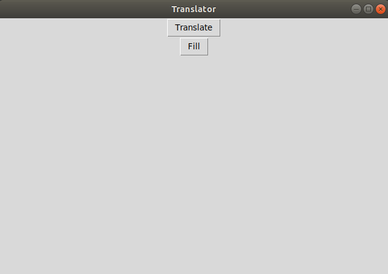
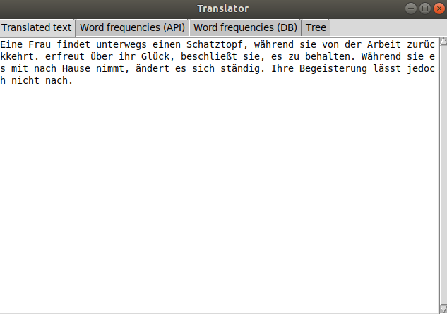
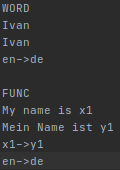
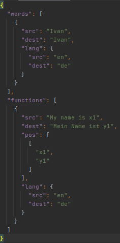

# Translator (GUI and CLI)

This translator was implemented as part of lab No.4

## Requirements

For requirements installation use

    pip3 install -r requirements.txt

---
**NOTE**

Install `pip3` before. For this use:

    sudo apt install python3-pip

---

## USAGE

usage: `main.py [-h] [-G | -C] [-F | -T] [--file FILE]`

optional arguments:

* `-h`, `--help` show help message and exit
* `-G`, `--gui` start program with GUI (if include this argument all other will be ignored) [using this mode by default]
* `-C`, `--cli` start program with CLI
* `-F`, `--fill` indicates that the file contains information to fill the database
* `-T`, `--translate` indicates that the file contains text to translate [using this mode by default]
* `--file` FILE specify path to file

GUI looks like this:

When you click `Translate` or `Fill` button app asks you to choose source file.

If you choose `Fill` option after fill operation you'll see message with results. If you choose `Translate` option after
translate operation you'll see this window:

Here 4 tabs:

- translated text;
- word frequencies from API translation;
- word/func frequencies from DB translation;
- tab with trees for text sentences.

## DB Filling

There are 2 file formats for filling the database: TXT and JSON.

